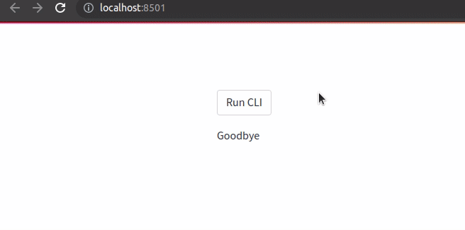

# streamlit-backend-cli-runner



Install [Poetry](https://python-poetry.org/)
```
curl -sSL https://install.python-poetry.org | python3 -
```

Install dependencies
```
poetry install
source $(poetry env info --path)/bin/activate
```

Run app
```
streamlit run test_streamlit.py
```